# CivilHelp: Construction Workforce Management

**CivilHelp** is a robust, premium-designed Flutter mobile and web application engineered to streamline workforce and operations management in the construction industry. Designed specifically for builders, contractors, and site supervisors, CivilHelp provides real-time visibility into attendance, worker advances, payroll processing, and financial reporting across multiple construction sites.

---

## 🏗️ Architecture & Core Design Patterns

The codebase is built on **Flutter (Dart)** and follows a modular, scalable architecture combining **Clean Architecture** (for domain-heavy features) and a **Feature-First Pattern** (for rapid development of UI-centric modules).

### 1. High-Level Folder Structure
- **[`lib/app/`](lib/app/)**: Application-wide configurations including themes ([`theme.dart`](lib/app/theme.dart)) and global routing ([`router.dart`](lib/app/router.dart)).
- **[`lib/core/`](lib/core/)**: Cross-cutting concerns such as global permission definitions, enums (e.g. roles and payment statuses), database models, and utility classes.
- **[`lib/data/`](lib/data/)**: Repository implementations, Firestore integrations, and local databases (Hive).
- **[`lib/features/`](lib/features/)**: Independent feature modules containing UI screens, controllers (Riverpod providers), and domain models.
- **[`lib/shared/`](lib/shared/)**: Universal components including common layouts, widgets, modals, form inputs, and route guards.

### 2. Feature Architecture
To balance modularity and velocity, features are organized in two paradigms:
- **Clean Architecture (Domain/Data/Presentation separation)**:
  - Applied to complex features like **Labour** (`lib/features/labour/`).
  - Segregates the business rules (`domain/entities` and `domain/repositories`) from state controllers/UI (`presentation/`) and API integrations (`data/`).
- **Feature-First Model-Provider-Screen Pattern**:
  - Applied to modules such as **Attendance**, **Sites**, **Payments**, **Advances**, **Payroll**, and **Reports**.
  - Groups files into `models/`, `providers/`, `repositories/`, `screens/`, and `widgets/` for clear modular encapsulation.

### 3. Role-Based Access Control (RBAC) & Security
CivilHelp integrates a strict, multi-tenant permission framework:
- **Tenant Context (`TenantGuard` & `CompanySetupGuard`)**:
  - Every authenticated request is checked for a corresponding company affiliation. If not associated or if the tenant is inactive, users are redirected to setup flows ([`tenant_guard.dart`](lib/shared/layouts/tenant_guard.dart)).
- **Granular Permissions (`PermissionGuard`)**:
  - Permissions are decoupled from roles using a centralized mapping in [`permissions.dart`](lib/core/auth/permissions.dart).
  - Screens and database writes verify specific capabilities (e.g., `Permission.viewReports`, `Permission.manageLabour`) using visual wrapper guards and Firestore rules.
- **Defined User Roles**:
  - **Owner**: Full administrative control over companies, sites, workers, payroll, and financials.
  - **Supervisor**: Restricted role focused on logging attendance and managing assigned sites (via site assignment).
  - **Admin**: Executive oversight dashboard.
  - **Partner**: View-only partner dashboard.
  - **Pending**: Setup state for unassigned new sign-ups.

---

## 📱 Tech Stack & Target Versions

### SDK Environment
- **Flutter SDK**: `3.44.1` (tested stable framework version)
- **Dart SDK / SDK Constraint**: `^3.12.0` (as defined in `pubspec.yaml`)

### Key Dependencies
- **State Management**: [Riverpod (v2.6.1)](https://pub.dev/packages/flutter_riverpod) for reactive stream and future data flows.
- **Backend / Database**: 
  - **Firebase Core (`^3.15.1`)** & **Firebase Auth (`^5.6.2`)** with native **Google Sign-In (`^6.2.1`)**.
  - **Cloud Firestore (`^5.6.11`)** for real-time document storage.
  - **Firebase Storage (`^12.4.9`)** for assets/logos.
- **Local Storage**: [Hive (`^2.2.3`)](https://pub.dev/packages/hive) & [Hive Flutter (`^1.1.0`)](https://pub.dev/packages/hive_flutter) for key-value local configuration caching.
- **UI & Responsive Layout**:
  - Responsive layouts supporting both mobile and web viewpoints ([`responsive_layout.dart`](lib/shared/layouts/responsive_layout.dart)).
  - Glassmorphic panels, blur backdrops, premium gradients, and custom micro-animations.
  - **ScreenUtil (`^5.9.3`)** for UI responsiveness across different form factors.
- **File & Exports**:
  - [Pdf (`^3.12.0`)](https://pub.dev/packages/pdf) & [Printing (`^5.14.3`)](https://pub.dev/packages/printing) for report PDF generation and printing.
  - [Excel (`^4.0.6`)](https://pub.dev/packages/excel) for downloading ledger reports.

---

## 🗄️ Firebase Firestore Schema

Derived from [`firestore.rules`](firestore.rules) and repository structures, the collection tree uses a tenant-separated sub-collection structure nested under `/companies` with the package ID configured as `com.palliverse.civilhelp`:

```mermaid
graph TD
    users["/users/{uid} (Global User Profiles)"]
    companies["/companies/{companyId} (Company Details)"]
    
    invitations["/companies/{companyId}/invitations/{invitationId} (Company-level invitations)"]
    sites["/companies/{companyId}/sites/{siteId} (Work Sites)"]
    attendanceCompletions["/companies/{companyId}/sites/{siteId}/attendanceCompletions/{dateString} (Daily Completion Status)"]
    labour["/companies/{companyId}/labour/{labourId} (Workers)"]
    attendance["/companies/{companyId}/attendance/{attendanceId} (Attendance Logs)"]
    unlockAudits["/companies/{companyId}/attendanceUnlockAudits/{auditId} (Unlock Logs)"]
    periods["/companies/{companyId}/payrollPeriods/{periodId} (Payroll Periods)"]
    payments["/companies/{companyId}/payments/{paymentId} (Recorded Payments)"]
    registers["/companies/{companyId}/payrollRegisters/{registerId} (Payroll Calculations)"]
    summaries["/companies/{companyId}/payrollSummaries/{periodId} (Financial Highlights)"]
    advances["/companies/{companyId}/advances/{advanceId} (Cash Advances)"]
    recoveries["/companies/{companyId}/advanceRecoveries/{recoveryId} (Deductions)"]

    companies --> invitations
    companies --> sites
    sites --> attendanceCompletions
    companies --> labour
    companies --> attendance
    companies --> unlockAudits
    companies --> periods
    companies --> payments
    companies --> registers
    companies --> summaries
    companies --> advances
    companies --> recoveries
```



### Collection Definitions
1. **`/users`**: Key details like email, role, and active status.
2. **`/companies`**: Basic tenant information, owner reference, and configuration rules (e.g. `attendanceBackdateLimitDays`).
3. **`/companies/{id}/invitations`**: Invitations sent to supervisors or other team members (queried via collection group `invitations` during onboarding).
4. **`/companies/{id}/sites`**: Construction site descriptions, budgets, and address information.
5. **`/companies/{id}/labour`**: Profile of workers, status (`active`/`inactive`), and daily wages.
6. **`/companies/{id}/attendance`**: Attendance logs mapped under document ID format `labourId_siteId_dateString`.
7. **`/companies/{id}/advances`**: Tracks cash advances lent to workers.
8. **`/companies/{id}/payments`**: Final payroll settlements and historical worker payouts.

---

## 🛠️ Getting Started & Local Development

### 1. Prerequisites
- **Flutter SDK**: `3.44.1`
- **Dart SDK**: `3.12.1`
- **Android SDK** (for Android builds) or **Xcode** (for iOS/macOS)

### 2. Firebase Configuration
Make sure the Firebase project is configured for your platform:
1. Initialize Firebase CLI:
   ```bash
   dart pub global activate flutterfire_cli
   flutterfire configure
   ```
2. For Android development, download and place `google-services.json` inside the [`android/app/`](android/app/) directory. Configure package name to `com.palliverse.civilhelp`.
3. For iOS development, download and place `GoogleService-Info.plist` inside `ios/Runner/`.

### 3. Google Sign-In Setup & Authentication
To allow Google Sign-In to authenticate with Firebase:

#### Local Development
1. Extract your local debug/upload certificate SHA-1 fingerprint (located in `~/.android/debug.keystore`).
2. Add this fingerprint to your Firebase Console settings under your Android application (`com.palliverse.civilhelp`).
3. Download the updated `google-services.json` and save it to [`android/app/`](android/app/).

#### Play Store Deployment
Google Sign-In requires **both** of the following certificate fingerprints to be added to your Firebase settings:
1. **Upload Certificate SHA-1**: The signature of the key used to sign your build bundle (`.aab`) locally before uploading.
2. **Play App Signing Certificate SHA-1**: The signature of the key Google uses to sign the final delivered APKs (located in Google Play Console under **Setup -> App integrity -> App signing**).

> [!WARNING]
> **Symptom**: If you get `PlatformException(sign_in_failed, ApiException: 10)` on a Play Store downloaded build, it is almost always because the **Play App Signing SHA-1 fingerprint** has not been added to your Firebase console. Copy it from the Play Console and register it in Firebase to resolve.

---

## 🔑 Android Release Signing

To bundle the application for production, you must sign it with an upload keystore.

### Component Breakdown
- **`android/upload-keystore.jks`**: Keystore containing the upload signing credentials.
- **`android/key.properties`**: Local credentials pointer file (never committed). Create it locally under `android/key.properties` with placeholders replaced:
  ```properties
  storePassword=<YOUR_PASSWORD>
  keyPassword=<YOUR_PASSWORD>
  keyAlias=upload
  storeFile=../upload-keystore.jks
  ```
- **Release Signing Configurations**: Loaded by [`build.gradle.kts`](android/app/build.gradle.kts) to sign release and debug builds during local development and testing.

---

## 🚀 Play Store Deployment

### Internal Testing
1. **Build the Android App Bundle (AAB)**:
   ```bash
   flutter build appbundle --release
   ```
   Ensure you increment the build number (e.g. `version: 1.0.0+8`) in `pubspec.yaml` prior to building.
2. **Upload to Play Console**:
   - Go to **Testing -> Internal testing** and create a new release.
   - Upload the `.aab` located at `build/app/outputs/bundle/release/app-release.aab`.
3. **Distribute to Testers**:
   - Add tester email addresses to your testing list.
   - Provide them the web link to opt into testing and download the app via Google Play Store.

### Production Release
1. **Promote the Build**:
   - In Play Console, promote the internal build to the **Production** track or create a new production release.
2. **Submit for Review**:
   - Complete store listing verification and submit the build for review.
3. **Monitor Rollout**:
   - Monitor review approval and stage/monitor the rollout percentage.

### Lessons Learned from the Release Process
- **Play App Signing Fingerprints**: Firebase must be explicitly configured with the Google Play App signing SHA-1 signature. Forgetting this results in silent Google Sign-In developer crashes (`ApiException: 10`) on Play Store builds.
- **Strict Version Control**: Google Play Console requires incremented version suffix codes (e.g. `+8`) for every bundle upload.

---

## 🧪 Testing

The codebase includes an extensive suite of automated unit and integration tests located in [`test/`](test/):
- **`attendance_hardening_test.dart`**: Validates edge-cases around attendance limits, lock validations, and date formats.
- **`legacy_attendance_migration_test.dart`**: Verifies data schema migrations.
- **`payroll_settlement_test.dart`**: Tests automated calculations of worker wages, advance recoveries, and settlement balances.
- **`report_reconciliation_test.dart`**: Confirms accuracy of outstanding balance ledgers and site summaries.

Run tests using the Flutter CLI:
```bash
flutter test
```
